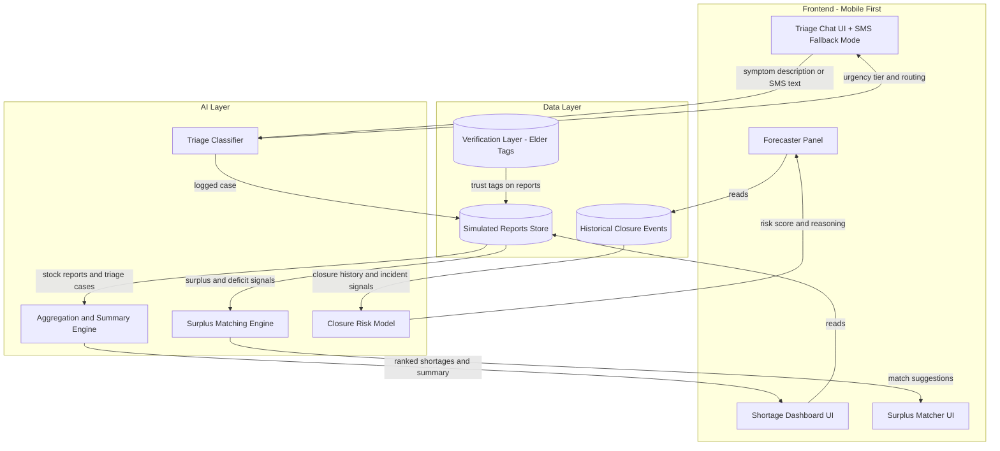

# Kurram Pul — Final Spec & Build Prompt (v3)

**Event:** Banao Imaginathon
**City:** Parachinar, Kurram District, Khyber Pakhtunkhwa
**Domain:** Health
**Team code:** TSAUPM
**Build window:** 26 Sep 12:00 AM – 28 Sep 12:00 AM PKT (48 hours)
**Built with:** Claude Code

---

## 1. Problem Statement

Parachinar (population roughly 400,000–600,000) sits at the far end of the Thall–Parachinar road, the single main route connecting it to Peshawar and the rest of Pakistan. The Kharlachi border crossing to Afghanistan is the only other route, and it closes in parallel during unrest.

When sectarian clashes or security incidents occur, this road is closed, sometimes for weeks or months. During the most recent closure (Oct 2024 into early 2025):

- The road was shut for over 60 days.
- Food, fuel, cooking gas, and medicine ran out across the city.
- DHQ Hospital Parachinar ran out of basic medicines, oxygen, and surgical supplies.
- Multiple reports (Dawn, RFE/RL, local chemist associations) put child deaths from medicine shortages at 29 to over 50, with some estimates exceeding 100 as the crisis worsened.
- Telecom and internet service also degraded during the unrest, not just the physical road. Responders and residents were often working with partial or no connectivity on top of no supply access.
- Relief came through sporadic air ambulance flights and Edhi Foundation supply deliveries, coordinated largely through news reports, word of mouth, and ad hoc phone calls, not structured data.
- Past closures have historically ended through tribal jirga mediation, not government intervention. This is the actual conflict-resolution structure in Kurram, and it is a structure this project can work with rather than around.

This is a repeating failure mode, not a one-off. Each cycle: a closure happens, both supply and communication degrade together, shortages compound within days, and there is no structured way for responders to see who needs what, verify which reports are trustworthy, or catch surplus sitting unused nearby, until the crisis is already a headline.

## 2. Core Idea

**Kurram Pul** is a four-part system built around one central assumption other projects on this map will likely miss: during a Parachinar crisis, communication breaks down at the same time supply does. Every component is designed to degrade gracefully, not just work in the best case.

1. **Triage Assistant** — a chat interface, with an SMS-style fallback mode, for residents or health workers to describe a medical situation and get an AI-driven urgency classification and next step.
2. **Shortage Dashboard** — a live aggregation view of supply reports, with jirga-elder verification for trust, and a staleness indicator so a report that's gone silent is itself treated as a signal.
3. **Surplus Matcher** — the differentiator. Instead of only routing everything outward to distant responders, it matches surplus in one area against deficit in another, inside the district, enabling same-day fixes that don't depend on the road reopening at all.
4. **Closure-Risk Forecaster** — flags rising risk of a new closure based on historical patterns and current incident signals, so hospitals and NGOs pre-stock before the road shuts, not after.

## 3. Adoption Path

This is not a new behavior invented from nothing. Pharmacy owners, hospital staff, and Edhi Foundation coordinators already coordinate informally by phone and WhatsApp during closures. Kurram Pul formalizes that into a structured, shared, verifiable view, and adds the one thing informal coordination can't do well: matching surplus to deficit across areas in real time.

**Realistic first users and how trust is built in:**
- DHQ Hospital Parachinar staff, logging medicine and equipment stock directly.
- 2-3 named local pharmacies, reporting stock status.
- Edhi Foundation field coordinators, already physically present and trusted, logging community-level reports.
- **Tribal elders / jirga representatives**, acting as verification nodes. In a context where rumor and misinformation spread fast during unrest, having a report tagged "verified by [named elder/area representative]" gives responders a trust signal that a raw crowdsourced report can't provide on its own. This mirrors how Kurram actually resolves disputes and distributes trust, rather than importing an outside trust model that doesn't fit the place.
- Residents, using the triage assistant when a hospital visit isn't possible, with SMS as a fallback when data service is down.

State this explicitly in the pitch and submission notes: the mechanism plugs into structures and relationships that already exist in Kurram, rather than asking the community to trust something entirely new.

## 4. Why This Fits the Judging Criteria

| Criterion | Points | How this project earns full marks |
|---|---|---|
| City understanding | 20 | Grounded in documented events AND in Kurram's actual social structure (jirga mediation, informal WhatsApp-based coordination) rather than just casualty statistics |
| Solution and impact | 25 | Explicitly designed for the reality that communication breaks down alongside supply, with an offline fallback and a same-day peer-to-peer fix that doesn't require the road to reopen |
| Original thinking | 20 | The surplus matcher is the piece unlikely to appear elsewhere: most "crisis dashboard" ideas stop at visibility, this one closes the loop into action within the district |
| Execution | 25 | Four fully working components, mobile-first, with a real Urdu/Pashto UI toggle and a functioning offline/SMS-simulated fallback, not just described in text |
| Clarity | 10 | A 90-second video walkthrough showing one full scenario end to end, alongside the one-line pitch |

## 5. Full Architecture



### Suggested Tech Stack

- **Frontend:** Mobile-first React or plain HTML/JS single-page app. Design for a phone screen first, desktop second.
- **Language toggle:** Real UI-level Urdu/Pashto/English toggle for all labels and buttons, not just backend AI comprehension. This matters for execution scoring since it's the difference between "the AI understands Urdu" and "a Parachinar resident could actually use this."
- **Offline/SMS fallback:** Simulate a text-only mode (a simplified, low-graphics view that mimics what an SMS gateway would deliver), demonstrating that the system degrades gracefully rather than requiring full connectivity.
- **AI:** Claude API calls for triage classification, aggregation/summary, surplus matching logic, and closure-risk reasoning.
- **Data:** JSON seed files for reports, verification tags, and historical closure events. No database required.
- **Styling:** Calm, high-contrast, consistent severity color coding (red/critical, orange/warning, green/stable, gray/stale) across every component.

### Suggested Project Structure (for Claude Code)

```
kurram-pul/
├── index.html
├── src/
│   ├── components/
│   │   ├── TriageChat.jsx
│   │   ├── SmsFallbackView.jsx
│   │   ├── ShortageDashboard.jsx
│   │   ├── SurplusMatcher.jsx
│   │   ├── ForecasterPanel.jsx
│   │   ├── SeverityBadge.jsx
│   │   ├── VerificationTag.jsx
│   │   └── LanguageToggle.jsx
│   ├── data/
│   │   ├── seed-reports.json
│   │   ├── verification-tags.json
│   │   └── closure-history.json
│   ├── ai/
│   │   ├── triagePrompt.js
│   │   ├── aggregationPrompt.js
│   │   ├── surplusMatchPrompt.js
│   │   └── forecasterPrompt.js
│   ├── i18n/
│   │   ├── en.json
│   │   ├── ur.json
│   │   └── ps.json
│   └── App.jsx
└── README.md
```

## 6. Component 1: Triage Assistant

### Purpose
Let a resident or health worker describe a situation in plain language and get an immediate urgency classification plus a clear next step, whether they have full connectivity or only SMS-level access.

### Two Input Modes
1. **Chat mode** (full connectivity): chat-bubble interface.
2. **SMS-simulated mode** (degraded connectivity): plain-text, no images or rich UI, mimicking what would actually arrive over a basic SMS gateway. Build this as a real toggle in the demo, not just a mention in the README.

### Urgency Tiers
1. **Critical / Evacuate** — symptoms suggesting immediate danger (difficulty breathing, severe bleeding, high fever in an infant, chest pain, signs of shock). Output: flag for air ambulance / Edhi Foundation contact, with a short reason.
2. **Needs Medicine / Supplies** — a known condition needing a specific medicine in short supply. Output: log the need against the dashboard and surplus matcher, suggest the nearest reporting pharmacy with stock.
3. **Routine / Monitor** — non-urgent. Output: basic guidance and a note to re-check if symptoms worsen.

### Triage Classifier Prompt

```
You are a medical triage assistant for Parachinar, Pakistan, a city currently
cut off from outside supply due to a road closure, where communication
service may also be degraded. You are NOT a replacement for a doctor. You
exist to triage cases when hospital access is limited or delayed, and to
route the case to the right kind of help.

Given a plain-language description of a patient's condition (which may
arrive as a short SMS-style message), respond with:
1. urgency_tier: one of ["critical", "needs_supplies", "routine"]
2. reason: one sentence explaining the classification
3. recommended_action: a short, concrete next step
4. supply_needed: if applicable, name the specific medicine or supply type

Always err toward a higher urgency tier when uncertain. Never provide a
definitive diagnosis. Keep language simple, calm, and free of jargon. If the
input is very short or fragmentary (consistent with SMS constraints), ask
exactly one clarifying question before classifying, unless the description
already clearly indicates a critical case.

Patient description: {user_input}

Respond only in JSON.
```

### UI Notes
- Chat bubble UI in full mode, stripped plain-text list in SMS mode.
- Color-coded urgency tier shown after classification (red/orange/green).
- Visible disclaimer at all times: "This is a prototype triage tool, not a substitute for medical care."

## 7. Component 2: Shortage Dashboard

### Purpose
Give a responder a real-time, trust-weighted view of where shortages are worst.

### Simulated Data Structure

```json
{
  "areas": [
    {
      "name": "Parachinar City Center",
      "reports": [
        { "supply": "Insulin", "status": "critical", "reported_by": "DHQ Hospital", "verified_by": "Hospital record", "timestamp": "2026-09-26T08:00:00Z" },
        { "supply": "Oxygen", "status": "critical", "reported_by": "DHQ Hospital", "verified_by": "Hospital record", "timestamp": "2026-09-26T08:10:00Z" },
        { "supply": "Antibiotics", "status": "low", "reported_by": "Al-Shifa Pharmacy", "verified_by": null, "timestamp": "2026-09-26T07:50:00Z" }
      ]
    },
    {
      "name": "Sadda",
      "reports": [
        { "supply": "Baby formula", "status": "critical", "reported_by": "Community reporter", "verified_by": "Area elder - Malik Jan", "timestamp": "2026-09-26T06:30:00Z" }
      ]
    },
    {
      "name": "Alizai",
      "reports": [
        { "supply": "Insulin", "status": "surplus", "reported_by": "Alizai Pharmacy", "verified_by": "Area elder - Sardar Khan", "timestamp": "2026-09-26T09:00:00Z" }
      ]
    }
  ],
  "triage_cases_logged": [
    { "area": "Parachinar City Center", "urgency_tier": "critical", "supply_needed": "Oxygen" }
  ]
}
```

Populate 5-6 realistic named areas (Parachinar city, Sadda, Alizai, Balishkhel, Bagan) with a mix of critical/low/stable/surplus statuses, some verified and some not, so the dashboard demonstrates the trust layer clearly.

### Staleness Handling
Any report older than a defined threshold (for the demo, simulate a 12-hour threshold) is shown grayed out with "last updated X hours ago." Treat a stale report as a signal worth flagging, not just missing data, since silence from an area during a crisis can itself indicate worsening conditions.

### Aggregation Engine Prompt

```
You are a logistics summarizer for humanitarian responders in Kurram
district, Pakistan, during a road closure crisis where verification and
timeliness of reports both matter. Given a list of supply reports (each
with a status, a reporter, an optional verification tag, and a timestamp)
and triaged medical cases, produce:

1. A ranked list of the 3 most urgent needs (area, supply, severity),
   noting whether each is verified or unverified
2. A one-paragraph summary in plain language for a responder who has
   30 seconds to read it, flagging any area with stale (no recent update)
   reports as a possible blind spot
3. A suggested order in which areas should receive relief first, with
   one-line reasoning for each

This data reflects simulated reports illustrating how the system would
function with real reporting in place. Treat it as representative, not
as a verified real-world finding.

Data: {json_data}

Respond in clear, structured text, not JSON.
```

### UI Notes
- Card or table view per area, color-coded by severity, with a distinct visual treatment for verified vs. unverified reports and stale reports.
- AI-generated summary box at the top.
- Stylized illustrative map with pins for each area.
- Clear "demo data illustrating system behavior" label.

## 8. Component 3: Surplus Matcher

### Purpose
Close the loop from visibility into action. If one area has surplus of a supply another area critically needs, the system should surface that as a same-day, in-district fix that doesn't depend on the road reopening or an outside supply drop arriving.

### Matching Logic
Compare all "surplus" or "stable, above-threshold" reports against all "critical" or "needs_supplies" reports of the same supply type across areas, and rank matches by proximity (use simple named-area adjacency for the demo, no real GPS routing needed) and urgency.

### Surplus Matching Prompt

```
You are a resource-matching assistant for Kurram district, Pakistan, during
a supply crisis where movement between areas is difficult but not always
impossible for local, short-distance transport.

Given a list of supply reports across named areas, each tagged with a
status (critical, low, stable, surplus) and a supply type, identify pairs
where one area's surplus could address another area's critical or
needs_supplies gap for the same supply type.

For each match, output:
1. From area, to area, and supply type
2. Urgency of the receiving area's need
3. A one-line rationale a coordinator could act on immediately
   (e.g., "Alizai has surplus insulin and is a short distance from
   Parachinar City Center, which has a critical insulin shortage")

If no matches exist for a given supply type, state that clearly rather
than forcing a weak match.

Data: {json_data}

Respond in clear, structured text.
```

### UI Notes
- A simple "matches found" list, each with a one-tap "notify coordinator" button (can be a non-functional demo button, since the point is showing the mechanism).
- This component should visually sit between the dashboard and the triage assistant, since it draws from both.

## 9. Component 4: Closure-Risk Forecaster

### Purpose
Flag rising risk of a new road closure before it happens, so hospitals and NGOs can pre-stock instead of scrambling once the road is already shut.

### Simulated Historical Data Structure

```json
{
  "past_closures": [
    { "start": "2024-10-01", "end": "2024-12-15", "duration_days": 76, "trigger": "Tribal clashes over land dispute" },
    { "start": "2023-08-10", "end": "2023-08-25", "duration_days": 15, "trigger": "Security incident on convoy" }
  ],
  "current_signals": [
    { "date": "2026-09-20", "signal": "Reported tension between tribal groups near Sadda", "severity": "moderate" },
    { "date": "2026-09-24", "signal": "Increased security checkpoints on Thall road", "severity": "low" }
  ]
}
```

### Forecaster Prompt

```
You are a risk analyst reviewing patterns of road closures affecting
Parachinar, Kurram district, Pakistan. Given a history of past closures
(dates, durations, and triggers) and a list of current incident signals,
produce:

1. A risk_level: one of ["low", "elevated", "high"]
2. A short explanation grounded in the specific historical pattern and
   current signals provided
3. A concrete recommendation for hospitals and NGOs (for example,
   "pre-stock a 30-day supply of insulin and oxygen given historical
   closure durations averaging X days")

Be explicit that this is a pattern-based estimate, not a prediction of
certainty. Do not overstate confidence.

Historical closures: {closure_history}
Current signals: {current_signals}

Respond in clear, structured text.
```

### UI Notes
- A risk gauge or badge (low/elevated/high), with reasoning shown underneath.
- A short timeline visualization of past closures and durations.
- Frame this in the pitch as the piece that shifts the whole system from reactive to proactive.

## 10. Build Order (for Claude Code)

1. Scaffold the app shell, mobile-first layout, and navigation between the four components.
2. Build the Shortage Dashboard first with static seed data, including verification tags and staleness handling, before wiring in AI.
3. Wire in the Aggregation Engine prompt for the dynamic summary.
4. Build the Triage Assistant chat UI and classifier prompt, then add the SMS-fallback toggle view.
5. Connect triage-logged cases into the dashboard's data store.
6. Build the Surplus Matcher, reading from the same data store as the dashboard.
7. Build the Forecaster panel with seed historical data.
8. Add the language toggle (English/Urdu/Pashto) across all UI labels.
9. Polish: consistent severity color coding, disclaimers, "demo data" labeling, and the verification/staleness visual treatment.
10. Deploy to a public static host or publish as an Artifact, test the link in a private browser window.
11. Record the 90-second pitch video (see Section 12).

## 11. Submission Checklist (per Banao rules)

- [ ] Parachinar claimed (done)
- [ ] Project name and one-liner added to the public dashboard
- [ ] Domain set to Health
- [ ] All four components built and working end to end
- [ ] Mobile-first layout confirmed on an actual phone screen size
- [ ] Language toggle functional across all four components
- [ ] SMS-fallback mode functional, not just described
- [ ] Demo data clearly labeled as simulated/illustrative
- [ ] Adoption path stated explicitly in submission notes (jirga elders and Edhi Foundation coordinators as first reporters/verifiers)
- [ ] Deployed to a public link, viewable by "Anyone with the link"
- [ ] Link tested in a private/incognito browser window
- [ ] Submission form filled in: what it's about, what was built, domain, main link
- [ ] Pitch video linked as the demo link
- [ ] Repository link added (optional, strengthens execution score)
- [ ] AI tools credited honestly (Claude Code, Claude API)
- [ ] "Submit final project" pressed, not just saved as draft
- [ ] Vote for 4 projects once community voting opens (28-30 Sep)

## 12. 90-Second Pitch Video Script Outline

1. **0:00-0:10** — Cold open with the stat: "In the last closure of the road to Parachinar, over 50 children died from a medicine shortage that lasted more than two months." (Text on screen, no dramatization.)
2. **0:10-0:20** — "The road closes. So does phone and internet service. Nobody knows who needs what until it's already a crisis." State the core insight.
3. **0:20-0:45** — Screen recording: a triage case comes in through SMS mode, gets classified critical, appears on the dashboard, gets verified by an elder tag, and the surplus matcher immediately finds a nearby area with spare insulin.
4. **0:45-0:55** — Show the forecaster flagging elevated risk based on current tension signals, with a pre-stock recommendation.
5. **0:55-1:10** — One line on the adoption path: "This isn't a new app people have to learn. It's the WhatsApp groups pharmacies and Edhi coordinators already use, made structured and visible."
6. **1:10-1:30** — Close on the one-line pitch, team name, and city.

## 13. One-Line Pitch

"When the road to Parachinar closes, Kurram Pul tells responders who needs what, how urgently, who can help nearby, and how soon it might happen again, before it becomes a headline."
